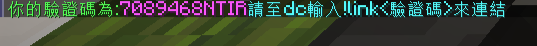
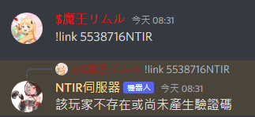

# 如何綁定Minecraft帳號？

### 加入Discord社群

請點選該連結 ([點我加入伺服DC](https://discord.gg/bv5emFs4eM))

## 如何綁定?

綁定係為方便伺服事務運作,並確認玩家身分,故玩家須綁定方可取用Discord社群的功能

### 綁定教學:&#x20;

首先,請進入Minecraft伺服器,並輸入指令`/verify`,輸入完成後會得到一串如下圖的驗證碼

之後,請到伺服Discord的💠綁定專區輸入指令!link <驗證碼> 若得到如下圖的回覆,即完成

若出現了以下圖片所陳述的狀況,請確認你的驗證碼沒有輸入錯誤,並確保你的Minecraft帳號正在線上

### 若確認皆沒問題,請聯繫管理員(務必使用客服系統)
